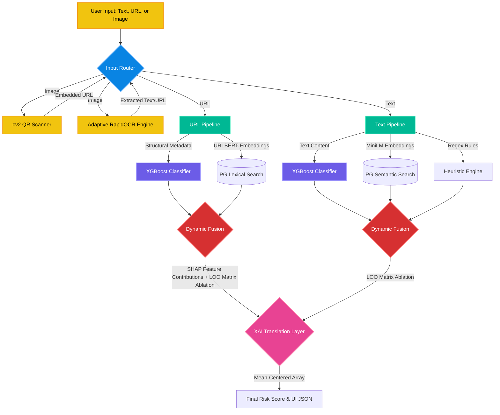

# 🛡️ AskVigil: Real-Time Multimodal Scam Detection

**AskVigil** is a high-performance, multimodal security engine designed to catch zero-day phishing, malicious links, and scam imagery in real-time. 

Moving beyond traditional static blocklists, AskVigil employs a dynamic **Retrieval-Augmented Classification (RAC)** architecture. By fusing semantic intent, structural lexical analysis, and predictive machine learning (XGBoost), it dissects payloads across Text, URLs, and Images (via OCR/QR extraction) with sub-millisecond precision. 

Every threat score is backed by a zero-latency **Explainable AI (XAI)** layer, translating complex matrix math into transparent, human-readable proof directly in the UI.

### ✨ Key Capabilities
* **Multimodal Ingestion:** Natively analyzes raw text, domains, and extracts embedded threats from images using adaptive computer vision.
* **Zero-Day Detection:** Uses calibrated predictive modeling to catch novel scams that have never been documented before.
* **Transparent AI:** No "black-box" decisions. Token-level feature ablation and semantic vector matching prove exactly *why* a payload was flagged.
* **Omnichannel Protection:** Accessible via a seamless web dashboard or our lightweight Discord Bot for community-level moderation.

---
## 🛠 The Tech Stack: Multimodal AI Architecture

### 🌐 Core Platform & Integrations
* **Frontend: React** — Flexible and industry-standard for building the analyst dashboard.
* **Backend: FastAPI** — High-performance Python. Fast to develop with native async support for our concurrent ML and Database pipelines.
* **Proxy: Nginx Proxy Manager** — GUI-based reverse proxy for DuckDNS and automated SSL certificate management.
* **Microservice: Discord Bot** — A lightweight, resource-capped asynchronous bot that securely queries the internal FastAPI network (`http://backend:8000`) without exposing its traffic to the public web, bringing real-time threat analysis directly to community servers.

### 🛡 Core AI Engines
* **URL Intelligence: urlbert-tiny-v5** — A domain-specific transformer model used exclusively for URL analysis. It captures structural nuances (TLDs, subdomains, path entropy) better than generic language models.
* **Text Intelligence: Paraphrase-multilingual-MiniLM-L12-v2** — Specifically chosen for text semantic mapping. Optimized for high-throughput multilingual intent detection.
* **Predictive Head: XGBoost** — The "Generalization Engine" capable of catching zero-day signatures. 
    * *Robust Training Data:* Trained on a 70k+ dataset for text, and a 120k+ dataset for URLs. The URL dataset was rigorously balanced using a custom **Water-Filling Stratification** algorithm across 8-dimensional structural metadata (TLD tier, entropy, path depth, etc.) to ensure rare edge-cases are preserved without class imbalance.
    * *Probability Calibration:* Applies context-aware **Platt Scaling** (`Sigmoid` for text nuance, `Isotonic` regression for URL F1 optimization) to convert raw margin scores into perfectly calibrated threat probabilities.

### 👁 Multimodal Inputs (Computer Vision)
* **High-Speed OCR: RapidOCR (PP-OCRv5)** — Optimized for hyper-efficient execution via a custom **Adaptive Image Router**. 
    * *Geometric Array Filtering:* Applied natively to OCR outputs to aggressively filter noise and refine bounding boxes.
    * *Adaptive Routing:* Analyzes image complexity (blur, contrast, entropy) to dynamically select the optimal inference pathway.
    * *Inference Optimization:* Implements width-bucket batching to minimize padding waste during ONNX execution.
    * *End-to-End System Latency:* Achieves total pipeline turnaround times—inclusive of downstream Retrieval-Augmented Classification (RAC)—ranging from **0.6s** for micro notifications to a maximum of **1.8s** for dense, fragmented blocks.
* **QR Logic: OpenCV (cv2.QRCodeDetector)** — Lightweight, low-latency detection that extracts and routes embedded URLs back into the primary scanning pipeline.D`

### 🏗 Infrastructure & Production Hardening
* **Database: PostgreSQL (pgvector + pg_trgm)** — Dual-method historical memory.
    * *Semantic:* `pgvector` HNSW indexing for text intent.
    * *Lexical:* Trigram-based `pg_trgm` structural search for URL patterns.
* **ARM64 Optimization (Oracle A1):** 
    * Every model is quantized and mapped via ONNX Runtime with hardcoded `intra_op_num_threads` to prevent Linux CFS context-switching lag.
    * Custom `shm_size` allocation in Docker to support parallel HNSW indexing and IPC tensor sharing for RapidOCR.
    * Implemented a **"Triple-Fire" Engine Warmup** script that saturates the CPU L2/L3 caches on startup, entirely eliminating 5-second cold-start penalties for sub-millisecond real-time inference.
* **Hardware-Level Container Governance:** To guarantee zero database corruption during heavy ML inference (RapidOCR/XGBoost), containers are strictly isolated using Docker resource limits. PostgreSQL I/O is mathematically capped via `blkio_config` (400 IOPS / 10mbps limits), while auxiliary services like the Discord bot are hard-capped to fractional CPUs to prevent compute hijacking.
* **Dynamic Asset Synchronization:** Heavy ML artifacts (ONNX models, XGBoost `.joblib` heads, and raw datasets) are entirely excluded from git. They are dynamically synced from an **Oracle Cloud Object Storage** bucket via Pre-Authenticated Requests (PAR) directly into a Docker named volume (`asset_data`) during deployment, keeping the repository lean.
* **Stateless Production Environment:** To prevent disk-bloat on the host Oracle A1 instance, the production server operates as a purely stateless inference engine with zero internal telemetry logging. System profiling and sub-millisecond benchmarking are handled entirely by offline, external polling scripts.
* **Pipeline Benchmarking:** The complete Retrieval-Augmented Classification (RAC) and Explainable AI (XAI) pipeline is hyper-optimized, executing from payload ingestion to final XAI UI JSON in just **0.095s to 0.181s** (scaling from short to long payloads).

---

## 🧠 How It Works: The Dynamic Fusion Architecture

Unlike standard static whitelists or single-model classifiers, this system uses a **Retrieval-Augmented Classification (RAC)** pipeline. It routes inputs through three parallel "brains" and dynamically weights their votes based on mathematical confidence.

1. **The Predictive Brain (XGBoost):** Evaluates the overarching pattern, entropy, and structure of the input to catch novel, zero-day scams that have never been seen before.
2. **The Historical Brain (PostgreSQL Retrieval):** Scans our database of known threats. It uses Semantic Search (Intent) for text, and Lexical Trigrams (Structural Overlap) for URLs.
3. **The Heuristic Brain (Rules Engine):** A hardcoded asymmetric regex defense for immediate, known-bad signatures.

**The Dynamic Fusion Engine:** 
The system does not simply average these scores. It uses a **Dimensional Normalization Engine (Weighted Geometric Mean)** to calculate *Effective Confidence*. If the Database pulls a result that has high consensus but poor structural grounding (a hallucination), the math automatically applies a severe penalty, silencing the database and seamlessly offloading the decision to the calibrated XGBoost model, and vice versa if the XGBoost model has no confidence.

---

## 🔍 Transparent Explainability (XAI)

Most ML security tools act as "black boxes." Our pipeline features a zero-latency, token-level Explainable AI layer that mathematically dissects the risk score and maps it directly to the UI using three distinct layers of proof:

1. **The Model's Intuition (Predictive Deltas):** We execute a highly vectorized Leave-One-Out (LOO) matrix ablation against the XGBoost head to prove exactly which tokens triggered the model's internal threat detection. (For URLs, we natively extract C++ SHAP values for structural heuristics).
2. **The Vibe Check (Semantic Similarity):** We mathematically break the Transformer "Anisotropy Cone" using dynamic mean-centering. We then calculate dot-products between unpooled query tokens and the database embeddings to highlight words that conceptually match historical threats.
3. **The Hard Evidence (Lexical Overlap):** We use memory-efficient set intersections to highlight exact structural overlaps (like typosquatted domains) that directly mirror known historical attacks.

### Architecture Diagram



## 🚀 Getting Started & Local Development

### 1. Prerequisites
* Install **Docker Desktop** and **VS Code**. 
* *Note on Hardware:* This stack runs entirely on **CPU-bound execution**. No local GPU is required—matching our production Oracle A1 ARM64 bare-metal architecture.

### 2. Quick Start Stack Initialization
1. Clone the repository.
2. Create a `.env` file in the root directory (refer to the project lead for the secure credentials template).
3. Spin up the unified container environment:

```bash
docker compose up --build
```

> ⏳ **First-Run Notice:** The initial build will take longer as it provisions the database schema, downloads the domain-specific AI models, and triggers the structural/semantic index populations.

### 3. Core Development Workflow
* **Code Interactivity:** The environment enforces immutable build parity. To hot-reload system logic, model configurations, or frontend states, execute:
  ```bash
  docker compose up --build backend
  ```
* **Database State:** The PostgreSQL layer features automated schema discovery and self-healing initialization. Database vector migrations are handled dynamically via mounted entrypoints. 
* **Dependency Management:** Python dependencies are strictly governed using a locked manifest (`uv.lock`). If you introduce a new dependency to the backend ecosystem, append it securely using the `uv` toolchain within the appropriate container context:
  ```bash
  uv add [library-name]
  ```

### 4. Local & Production Verification Paths
* **Local Analyst Dashboard:** http://localhost
* **Local OpenAPI (FastAPI) Docs:** http://localhost/docs
* **Production Public Gateway:** https://askvigil.duckdns.org
* **Production API Explorer:** Append `/api`, `/docs`, `/redoc`, or `/openapi.json` to the production gateway.

---

## ☁️ Cloud Asset Management & Storage Routing

Heavy infrastructure dependencies (such as the 120k/70k training sets, ONNX engine files, and raw `.joblib` predictive heads) are isolated from Version Control to prevent repository bloat. They are governed out-of-band via Oracle Cloud Infrastructure (OCI) Object Storage using Pre-Authenticated Request (PAR) endpoints.

### Synchronizing Assets
* **Automated Python Pipeline:** Execute the utility tracking script to map, verify, and stream local payloads directly to remote buckets:
  ```bash
  python scripts/upload_assets.py
  ```
* **Direct Binary Ingestion (cURL):** Alternatively, explicitly route localized binary layers directly to the OCI endpoint via terminal injection:
  ```bash
  curl -X PUT --data-binary "@local_file_name" "YOUR_PAR_URL/remote_file_name"
  ```
  *(Ensure your `OCI_PAR_URL` variable is securely isolated inside your `.env` and never leaked).*

---

## 🤖 Continuous Integration & Deployment (CI/CD)

We implement an automated, hands-off multi-stage pipeline utilizing **GitHub Actions** for zero-downtime microservice staging.

* **The Pipeline Flow:** Direct `git push origin main` triggers code-quality assessment gates -> Automation securely SSHes into the target Oracle A1 host instance -> Docker evaluates changed layers and compiles the updated container architecture automatically.
* **Secrets Separation:** Production configurations are localized directly within the server's runtime `.env`. GitHub holds encrypted keys strictly required for SSH and image layer provisioning.

---

## ⚠️ Platform Ground Rules

1. **Zero Git Leakage:** **Never** commit a `.env` file to source control. It is explicitly sandboxed via `.gitignore`.
2. **Asset Sanitization:** **Never** push model footprints or text/URL data arrays to Git. Utilize the Object Storage PAR pipeline exclusively.
3. **Pre-Flight Validation:** **Always** execute `docker compose up --build` locally to verify runtime integrity before pushing to the `main` branch.

### 🛠️ Developer Debugging Checklist
* **Import/Context Conflicts:** Encountering broken execution boundaries after an update? Completely tear down shared volumes and rebuild clean network interfaces:
  ```bash
  docker compose down && docker compose up --build
  ```
* **Manifest Lock Corruption:** If `uv.lock` registers structural validation conflicts, safely eliminate the corrupted artifact and allow the deterministic package manager to resolve the tree fresh:
  ```bash
  rm uv.lock && uv sync
  ```

---

## 📊 Detailed Performance Benchmarks

The inline metrics quoted across the OCR and RAC modules represent real-world stress testing. Expand the sections below to view the raw end-to-end performance matrices.

<details>
<summary>🚀 View Final RAC Performance Benchmark Matrix (End-to-end ethernet)</summary>

| Payload Category | Avg Compute Time | Min (Best Case) | Max (Worst Case) |
| :--- | :--- | :--- | :--- |
| **Short** (~150 chars) | 0.0952s | 0.0900s | 0.1150s |
| **Medium** (~500 chars) | 0.1246s | 0.1211s | 0.1290s |
| **Long** (~950 chars) | 0.1812s | 0.1738s | 0.2195s |

</details>

<details>
<summary>🚀 View Final OCR Performance Benchmark Matrix (End-to-end ethernet)</summary>

| Asset Category | File Size | Avg Compute Time | Min (Best) | Max (Worst) |
| :--- | :--- | :--- | :--- | :--- |
| **Micro Notification** | 8.3 KB | 0.5993s | 0.5790s | 0.6982s |
| **Dense Transaction Stream** | 67.6 KB | 0.5942s | 0.5714s | 0.6367s |
| **Uniform Stream** | 64.8 KB | 1.7194s | 1.6605s | 1.9414s |
| **Fragmented Block** | 102.0 KB | 1.7937s | 1.7456s | 1.9032s |
| **Sparse Matrix** | 117.5 KB | 1.7205s | 1.6841s | 1.8329s |

</details>

---

## 🔍 Known Limitations & Future Roadmap

### 1. Current Architectural Limitations

* **Inference Variable Retention:** Current real-time inference objects are processed directly in volatile server memory. While secure from persistent exposure, true production hardening requires explicit variable teardown routines immediately following UI execution blocks to optimize garbage collection on constraints-heavy CPU loops.
* **Intent-Blind Semantic Matching:** The current historical engine pairs a high-performance Bi-Encoder (`paraphrase-multilingual-MiniLM-L12-v2`) with a lexical engine (`pg_trgm`). In specific edge cases—primarily "Scam Warnings" or educational security writeups—the system can produce a False Positive. Because the retriever identifies high semantic similarity to scam templates, it remains blind to the meta-intent (e.g., a security analyst discussing a virus vs. a scammer deploying one).
* **The Performance Trade-off:** To guarantee a deterministic, sub-second production latency boundary (**<0.181s execution overhead**), we deliberately prioritized vector/lexical retrieval over slow generative reasoning for the MVP.

---

### 2. Future Work: Reasoning-Augmented Refinement (V2.0 Blueprint & Architectural Veto)

To resolve semantic ambiguity without sacrificing real-time throughput, we developed a blueprint for a localized, lightweight contextual gating layer. However, **this architecture was intentionally vetoed for the current MVP** due to critical engineering constraints.

#### **A. The Proposed Upgrade: Probabilistic Intent Calibration**
The V2 blueprint integrates a localized, quantized Small Language Model (SLM)—such as *Qwen2.5-0.5B-Instruct*—to execute flash context parsing in parallel with the main pipeline. The SLM is designed to extract a discrete **3-Bit Intent Vector** assessing:
1. **Posture:** (Professional/Analytical vs. Anonymous/Hostile)
2. **Pressure:** (Neutral Information vs. Coercive/Urgent Demands)
3. **Instruction:** (Educational Context vs. Action-Oriented Links/Prompts)

#### **B. Conformity-Scaled Fusion Math**
The SLM's contextual output would feed into a non-linear Conformity Score inside the Dynamic Fusion Engine to adjust retrieval weighting dynamically:

$$effective\_retrieval\_confidence = base\_retrieval\_confidence \times (1 - |risk - vibe|)^2$$

If the database retrieves an exact semantic match for a known scam phrase, but the SLM flags the overall document posture as an "Analytical Warning" (low alignment), the retrieval confidence is mathematically neutralized before the feature arrays hit the final XGBoost predictive head.

#### **C. Deep Dive: Why This Architecture Was Vetoed for the MVP**
While mathematically sound, this SLM integration was aggressively scoped out of production deployment for the following reasons:
* **The Generative Latency Tax:** Even a 0.5B model introduces a 300–600ms Time-To-First-Token (TTFT) penalty. This completely violates our strict, sub-200ms real-time inference SLA.
* **Quantization Brittleness:** Compressing a complex language model's reasoning capabilities down to a high-density, discrete 3-bit vector structure proved brittle during edge-case validation, leading to unpredictable classification degradation.
* **The Heuristic "Whack-a-Mole" Trap:** Attempting to map human intent into fixed structural buckets (Posture, Pressure, Instruction) quickly devolves into a game of whack-a-mole. Human speech patterns vary wildly, and adding more bits to catch conversational edge cases introduces endless rule creep and technical debt.
* **Data Preparation Overhead:** Introducing generative language modeling features would break our clean architectural separation. Instead of a fast, modular voting ensemble, we would have to restructure the downstream Dynamic Fusion Engine's normalization math and retrain our calibration layers, severely slowing down pipeline agility.

#### **D. Alternate Scope Implementations**
Instead of the SLM, immediate roadmap focus is locked on:
* **Dynamic Scam Classification:** The current MVP utilizes a fast, regex-based heuristic engine to classify scam types (e.g., Phishing vs. OTP Scam). A planned V2 enhancement will transition this to a dynamic metadata extractor, determining the scam type by analyzing the metadata of the closest semantic vectors retrieved by the Historical Brain, allowing for the classification of novel or blended scam archetypes.
* **Real-Time Drift Analysis:** Transitioning system performance tracking from an offline script (`benchmark.py`) into an asynchronous, non-blocking telemetry stream for live model evaluation.
* **Computer Vision Enhancements:** Deepening the adaptive OCR layout parsing layer to handle higher document structural skew and lower-contrast security inputs.