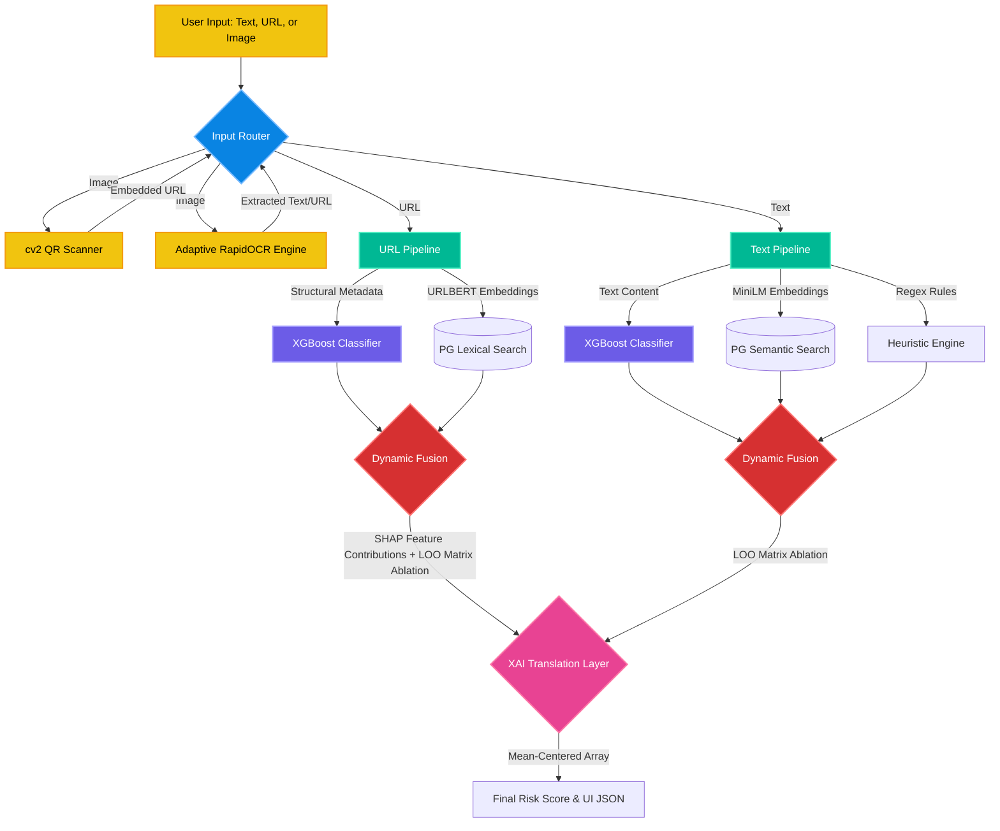

# AskVigil - a Scam Detector website app.

Welcome to AskVigil by SleepUnderflow. We are using a containerized Python stack. This means if it runs on your laptop in Docker, it **will** work on the Oracle server. You must have docker desktop running to run the code. Run `docker compose up --build` to update the running code.

General Syntax for inserting data into cloud storage:  
Just use scripts/upload_assets.py and edit it to the folders you want to upload. Or:
`curl.exe -X PUT --data-binary "@local_file_name" "PAR_URL/remote_file_name"`
PAR_URL goes into the .env file, it is not to be shared publicly.

---
## 🛠 The Tech Stack: Multimodal AI Architecture

### Base website
* **Frontend: React** — Flexible and industry-standard for building the analyst dashboard.
* **Backend: FastAPI** — High-performance Python. Fast to develop with native async support for our concurrent ML and Database pipelines.
* **Proxy: Nginx Proxy Manager** — GUI-based reverse proxy for DuckDNS and automated SSL certificate management.

### 🛡 Core AI Engines
* **URL Intelligence: urlbert-tiny-v5** — A domain-specific transformer model used exclusively for URL analysis. It captures structural nuances (TLDs, subdomains, path entropy) better than generic language models.
* **Text Intelligence: Paraphrase-multilingual-MiniLM-L12-v2** — Specifically chosen for text semantic mapping. Optimized for high-throughput multilingual intent detection.
* **Predictive Head: XGBoost** — The "Generalization Engine." Trained on 120k+ samples to recognize zero-day signatures across URLs and Text.

### 👁 Multimodal Inputs (Computer Vision)
* **High-Speed OCR: RapidOCR (PP-OCRv5)** — Optimized for 2-5x faster inference via a custom **Adaptive Image Router**. 
    * *Adaptive Routing:* Automatically switches between "Light" (mobile-grade) and "Server" (high-accuracy) models based on image complexity analysis (blur, contrast, entropy).
    * *Inference Optimization:* Implements width-bucket batching to minimize padding waste during ONNX execution.
* **QR Logic: OpenCV (cv2.QRCodeDetector)** — Lightweight, low-latency detection that extracts and routes embedded URLs back into the primary scanning pipeline.

### 🏗 Infrastructure & Production Hardening
* **Database: PostgreSQL (pgvector + pg_trgm)** — Dual-method historical memory.
    * *Semantic:* `pgvector` HNSW indexing for text intent.
    * *Lexical:* Trigram-based `pg_trgm` structural search for URL patterns.
* **ARM64 Optimization (Oracle A1):** 
    * Every model is quantized and mapped via ONNX Runtime with hardcoded `intra_op_num_threads` to prevent Linux CFS context-switching lag.
    * Custom `shm_size` allocation in Docker to support parallel HNSW indexing and IPC tensor sharing for RapidOCR.
    * Implemented a **"Triple-Fire" Engine Warmup** script that saturates the CPU L2/L3 caches on startup, entirely eliminating 5-second cold-start penalties for sub-millisecond real-time inference.

---

## 🧠 How It Works: The Dynamic Fusion Architecture

Unlike standard static whitelists or single-model classifiers, this system uses a **Retrieval-Augmented Classification (RAC)** pipeline. It routes inputs through three parallel "brains" and dynamically weights their votes based on mathematical confidence.

1. **The Predictive Brain (XGBoost):** Evaluates the overarching pattern, entropy, and structure of the input to catch novel, zero-day scams that have never been seen before.
2. **The Historical Brain (PostgreSQL Retrieval):** Scans our database of known threats. It uses Semantic Search (Intent) for text, and Lexical Trigrams (Structural Overlap) for URLs.
3. **The Heuristic Brain (Rules Engine):** A hardcoded asymmetric regex defense for immediate, known-bad signatures.

**The Dynamic Fusion Engine:** 
The system does not simply average these scores. It uses a **Dimensional Normalization Engine (Weighted Geometric Mean)** to calculate *Effective Confidence*. If the Database pulls a result that has high consensus but poor structural grounding (a hallucination), the math automatically applies a severe penalty, silencing the database and seamlessly offloading the decision to the XGBoost model.

---

## 🔍 Transparent Explainability (XAI)

Most ML security tools act as "black boxes." Our pipeline features a zero-latency, token-level Explainable AI layer that mathematically dissects the risk score and maps it directly to the UI using three distinct layers of proof:

1. **The Model's Intuition (Predictive Deltas):** We execute a highly vectorized Leave-One-Out (LOO) matrix ablation against the XGBoost head to prove exactly which tokens triggered the model's internal threat detection. (For URLs, we natively extract C++ SHAP values for structural heuristics).
2. **The Vibe Check (Semantic Similarity):** We mathematically break the Transformer "Anisotropy Cone" using dynamic mean-centering. We then calculate dot-products between unpooled query tokens and the database embeddings to highlight words that conceptually match historical threats.
3. **The Hard Evidence (Lexical Overlap):** We use memory-efficient set intersections to highlight exact structural overlaps (like typosquatted domains) that directly mirror known historical attacks.

### Architecture Diagram



## 🚀 Getting Started (Local Development)

### 1. Prerequisites
* Install **Docker Desktop** and **VS Code**. No GPU needed - CPU only, since our server doesn't have GPU anyway.

### 2. Setup
1.  Clone the repo.
2.  Create a `.env` file in the root directory (see the lead for the template).
3.  Fire up the stack:
    ```bash
    docker compose up --build
    ```
    _Note: The first run will take 5-10 minutes to download the Multilingual MiniLM model and initialize the database._
4.  The Workflow
    * **Editing Code:** Just edit any file in src/ (Frontend) or backend/. The app will auto-reload. You do NOT need to restart Docker.
    * **New Libraries:** If you add something to requirements.txt or package.json, you must re-run:
    ```bash
    docker compose up --build
    ```
    * **Database:** The pgvector extension and embeddings table are pre-configured. Just start the containers and start querying.

5.  Production (Oracle Cloud)
    * **Deployment:** Simply git push origin main.
    * **CI/CD:** GitHub Actions will automatically build and deploy to the Oracle server.
    * **Secrets:** Production secrets are managed on the server's .env. Do not push your local .env to Git.

6.  **Verification:**
    * **Local Frontend:** [http://localhost](http://localhost)
    * **Local API Docs:** [http://localhost/docs](http://localhost/docs) (FastAPI generates this automatically!)
    * **Production:** [https://askvigil.duckdns.org]
    * **Docs:** Go to [https://askvigil.duckdns.org] and append /api, /docs, /redoc, or /openapi.json for for whichever ones you want.

---

## ☁️ Deployment (CI/CD)

We are using **GitHub Actions** for "Hands-Off" deployment. 
* **The Flow:** Push your code to the `main` branch → GitHub SSHes into Oracle → Docker rebuilds only what changed.
* **Note:** If you need a new Python library, add it to `backend/pyproject.toml` with `uv add [library]`.

---

## ⚠️ Ground Rules
1. **Never** commit the `.env` file to Git (it’s in the `.gitignore`).
2. **Never** commit large AI model files or datasets. These go into Oracle Object Storage.
3. **Always** test your `docker compose up --build` locally before pushing to `main`.

## Developer Debugging Checklist:
Environment giving import errors after an update?  
Run `docker compose down` followed by `docker compose up --build`.  
If uv.lock died, you can delete it and run uv sync again to regenerate it.  